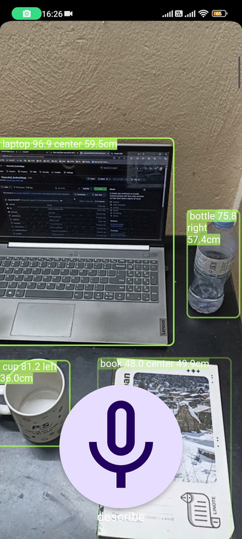

# VisionAid App
#### *VisionAid is an Android application designed to assist visually impaired individuals by enabling them to detect and locate objects, facilitating their daily activities.*

## Installation
### To run this app, please do the following instructions:
- Install Android Studio or similar IDE
- Install required SDK and plugins
- Connect IDE to physical device or emulator
- Move to `visionaid` folder
- Run command `flutter pub get` to install required dependencies
- Launch the application using either a command-line instruction or the IDE's run button
### Or download the apk file at:
https://drive.google.com/file/d/1fpizMtu2piqBR6MNR6NhSRa27boN_jQT/view?usp=drivesdk

## Acknowledgements
This application utilizes the `yolo-flutter-app` plugin; however, instead of simply importing it, we modified the source code to implement additional features customized for our requirements.

| Feature         | Original | VisionAid |
| --------------- | -------- | --------- |
| Detection       |  ✅      |  ✅  |
| Estimate Distance |  ❌      |  ✅  |
| Relative Position   |  ❌      |  ✅  |

The repository has been forked, ensuring compliance with the license.

## App Interface

